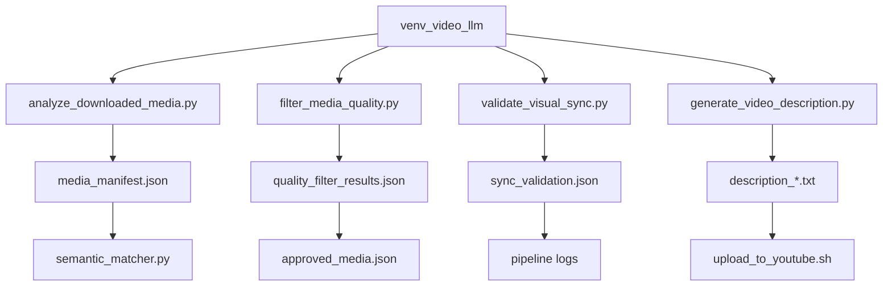

# Video LLM Pipeline Integration Plan

Step-by-step plan for integrating video LLM analysis into your daily pipeline.

---

## Overview

| Integration | Stage | Complexity | Dependencies |
|-------------|-------|------------|--------------|
| 1. Enhanced Media Descriptions | 5 (Curation) | Medium | `download_media.py` |
| 2. Automated Quality Filtering | 5 (Curation) | Low | `download_media.py` |
| 3. Visual-Lyric Sync Validation | 6 (Assembly) | Medium | `5_assemble_video.py` |
| 5. Auto-Generated Descriptions | 8 (Upload) | Low | `upload_to_youtube.sh` |

---

## 1. Enhanced Media Descriptions

**Goal**: Replace basic stock site descriptions with rich AI-generated descriptions for better semantic matching.

### Current Flow
```
download_media.py → media_manifest.json → semantic_matcher.py
                    (url, shot_number)     (uses stock descriptions)
```

### New Flow
```
download_media.py → analyze_media.py → enhanced_manifest.json → semantic_matcher.py
                    (video LLM)         (rich descriptions)      (better matching)
```

### Implementation Steps

#### Step 1.1: Create `agents/analyze_downloaded_media.py`

```python
#!/usr/bin/env python3
"""Analyze downloaded media clips using video LLM to generate rich descriptions."""

import json
import subprocess
import sys
from pathlib import Path

sys.path.insert(0, str(Path(__file__).parent))
from output_helper import get_output_path


def analyze_clip(video_path: str, topic: str) -> dict:
    """Analyze a single clip using MLX-VLM."""
    prompt = f"""Analyze this video clip for use in an educational video about: {topic}

Describe:
1. Main visual content (what is shown)
2. Motion and dynamics (camera movement, subject movement)
3. Colors and lighting
4. Educational relevance

Keep response under 100 words."""

    cmd = [
        sys.executable, "-m", "mlx_vlm.video_generate",
        "--model", "mlx-community/Qwen2-VL-2B-Instruct-4bit",
        "--prompt", prompt,
        "--video", video_path,
        "--max-tokens", "150",
        "--fps", "1.0"
    ]
    
    result = subprocess.run(cmd, capture_output=True, text=True, timeout=120)
    
    if result.returncode == 0:
        # Parse response from output
        output = result.stdout
        # Extract text between assistant markers
        return {"enhanced_description": output, "analysis_success": True}
    
    return {"enhanced_description": "", "analysis_success": False}


def main():
    # Load existing manifest
    manifest_path = get_output_path("media_manifest.json")
    with open(manifest_path) as f:
        manifest = json.load(f)
    
    # Load research for topic context
    research_path = get_output_path("research.json")
    with open(research_path) as f:
        research = json.load(f)
    topic = research.get("topic", "educational content")
    
    print(f"🔍 Analyzing {len(manifest['downloaded'])} clips with Video LLM...")
    
    for i, item in enumerate(manifest["downloaded"]):
        local_path = item["local_path"]
        print(f"  [{i+1}/{len(manifest['downloaded'])}] Analyzing {Path(local_path).name}...", end=" ")
        
        try:
            analysis = analyze_clip(local_path, topic)
            item["enhanced_description"] = analysis.get("enhanced_description", "")
            item["analysis_success"] = analysis.get("analysis_success", False)
            print("✅" if analysis["analysis_success"] else "⚠️")
        except Exception as e:
            item["enhanced_description"] = ""
            item["analysis_success"] = False
            print(f"❌ {e}")
    
    # Save enhanced manifest
    enhanced_path = get_output_path("media_manifest_enhanced.json")
    with open(enhanced_path, "w") as f:
        json.dump(manifest, f, indent=2)
    
    # Also update original for downstream compatibility
    with open(manifest_path, "w") as f:
        json.dump(manifest, f, indent=2)
    
    success_count = sum(1 for d in manifest["downloaded"] if d.get("analysis_success"))
    print(f"\n✅ Enhanced {success_count}/{len(manifest['downloaded'])} clips")


if __name__ == "__main__":
    main()
```

#### Step 1.2: Modify `pipeline.sh` Stage 5

Add after media download (line ~249):

```bash
# After download_media.py runs, enhance descriptions if video LLM is available
if [ -d "venv_video_llm" ]; then
    echo "🔍 Enhancing media descriptions with Video LLM..."
    source venv_video_llm/bin/activate
    if python3 agents/analyze_downloaded_media.py; then
        echo "  ✅ Media descriptions enhanced"
    else
        echo "  ⚠️ Enhancement failed, using original descriptions"
    fi
    deactivate
    source venv/bin/activate  # Return to main venv
fi
```

#### Step 1.3: Update `semantic_matcher.py`

Modify `match_videos_to_groups()` to prefer `enhanced_description` (line ~48):

```python
# Replace:
video_texts = [v["description"] for v in available_media]

# With:
video_texts = [
    v.get("enhanced_description") or v.get("description", "")
    for v in available_media
]
```

### Validation
- Run pipeline and check `media_manifest_enhanced.json` exists
- Verify `enhanced_description` fields are populated
- Compare video-lyric matching quality vs. baseline

---

## 2. Automated Quality Filtering

**Goal**: Auto-reject low-quality clips in express mode instead of blindly approving.

### Current Flow (Express Mode)
```
download_media.py → auto-approve ALL → video assembly
                    (no quality check)
```

### New Flow
```
download_media.py → quality_filter.py → approved_media.json
                    (video LLM rating)   (only quality clips)
```

### Implementation Steps

#### Step 2.1: Create `agents/filter_media_quality.py`

```python
#!/usr/bin/env python3
"""Filter downloaded media by quality using video LLM."""

import json
import subprocess
import sys
from pathlib import Path

sys.path.insert(0, str(Path(__file__).parent))
from output_helper import get_output_path

QUALITY_THRESHOLD = 5  # 1-10 scale, reject below this


def rate_clip_quality(video_path: str) -> int:
    """Rate clip quality on 1-10 scale."""
    prompt = """Rate this video clip's quality for educational use on a 1-10 scale.

Consider:
- Resolution and clarity (blurry = low score)
- Lighting quality
- Distracting watermarks or text
- Scientific/educational accuracy
- Professional appearance

Respond with ONLY a number 1-10, nothing else."""

    cmd = [
        sys.executable, "-m", "mlx_vlm.video_generate",
        "--model", "mlx-community/Qwen2-VL-2B-Instruct-4bit",
        "--prompt", prompt,
        "--video", video_path,
        "--max-tokens", "5",
        "--fps", "0.5"
    ]
    
    result = subprocess.run(cmd, capture_output=True, text=True, timeout=60)
    
    if result.returncode == 0:
        # Extract number from output
        import re
        numbers = re.findall(r'\b([1-9]|10)\b', result.stdout)
        if numbers:
            return int(numbers[-1])  # Take last number found
    
    return 5  # Default to threshold on failure


def main():
    manifest_path = get_output_path("media_manifest.json")
    with open(manifest_path) as f:
        manifest = json.load(f)
    
    print(f"🔍 Quality filtering {len(manifest['downloaded'])} clips...")
    
    approved = []
    rejected = []
    
    for item in manifest["downloaded"]:
        local_path = item["local_path"]
        filename = Path(local_path).name
        print(f"  Rating {filename}...", end=" ")
        
        try:
            score = rate_clip_quality(local_path)
            item["quality_score"] = score
            
            if score >= QUALITY_THRESHOLD:
                approved.append(item)
                print(f"✅ ({score}/10)")
            else:
                rejected.append(item)
                print(f"❌ ({score}/10 - below threshold)")
        except Exception as e:
            item["quality_score"] = 5
            approved.append(item)  # Keep on error
            print(f"⚠️ (defaulting to keep)")
    
    # Save filter results
    filter_results = {
        "approved": approved,
        "rejected": rejected,
        "threshold": QUALITY_THRESHOLD
    }
    
    filter_path = get_output_path("quality_filter_results.json")
    with open(filter_path, "w") as f:
        json.dump(filter_results, f, indent=2)
    
    print(f"\n✅ Approved: {len(approved)}/{len(manifest['downloaded'])}")
    print(f"❌ Rejected: {len(rejected)}")
    
    # Return exit code based on whether we have enough clips
    if len(approved) < 5:
        print("⚠️ WARNING: Too few clips approved, may affect video quality")
        sys.exit(2)  # Non-fatal warning


if __name__ == "__main__":
    main()
```

#### Step 2.2: Modify `pipeline.sh` Express Mode (lines ~274-295)

Replace auto-approve section with quality filtering:

```bash
else
    echo -e "${YELLOW}━━━━━━━━━━━━━━━━━━━━━━━━━━━━━━━━━━━━━━━━${NC}"
    echo -e "${YELLOW}Express Mode: Quality Filtering Media${NC}"
    echo -e "${YELLOW}━━━━━━━━━━━━━━━━━━━━━━━━━━━━━━━━━━━━━━━━${NC}"
    
    # Run quality filter if video LLM available
    if [ -d "venv_video_llm" ]; then
        source venv_video_llm/bin/activate
        python3 agents/filter_media_quality.py
        FILTER_EXIT=$?
        deactivate
        source venv/bin/activate
        
        if [ $FILTER_EXIT -eq 2 ]; then
            echo "⚠️ Few clips approved, continuing with available media"
        fi
    fi
    
    # Continue with existing auto-approve logic but using filtered results
    cp "${OUTPUT_DIR}/media_plan.json" "${OUTPUT_DIR}/approved_media.json"
    # ... (rest of existing approval code)
fi
```

### Validation
- Run with `--express` flag
- Check `quality_filter_results.json` for scores
- Verify rejected clips are low quality

---

## 3. Visual-Lyric Sync Validation

**Goal**: After assembly, validate that visuals match lyric content and flag mismatches.

### Current Flow
```
5_assemble_video.py → final_video.mp4
                      (no validation)
```

### New Flow
```
5_assemble_video.py → validate_sync.py → sync_validation.json
                      (video LLM)         (mismatch report)
```

### Implementation Steps

#### Step 3.1: Create `agents/validate_visual_sync.py`

```python
#!/usr/bin/env python3
"""Validate visual-lyric synchronization using video LLM."""

import json
import subprocess
import sys
from pathlib import Path

sys.path.insert(0, str(Path(__file__).parent))
from output_helper import get_output_path


def validate_segment(video_path: str, expected_topic: str, start: float, end: float) -> dict:
    """Validate a video segment matches expected topic."""
    # Extract segment (would need ffmpeg in production)
    prompt = f"""Does this video visually match the educational topic: "{expected_topic}"?

Rate the match on a 1-10 scale where:
- 10 = Perfect visual representation
- 5 = Tangentially related
- 1 = Completely unrelated

Respond in format: SCORE: [1-10], REASON: [brief explanation]"""

    cmd = [
        sys.executable, "-m", "mlx_vlm.video_generate",
        "--model", "mlx-community/Qwen2-VL-2B-Instruct-4bit",
        "--prompt", prompt,
        "--video", video_path,
        "--max-tokens", "50",
        "--fps", "1.0"
    ]
    
    result = subprocess.run(cmd, capture_output=True, text=True, timeout=120)
    
    import re
    score_match = re.search(r'SCORE:\s*(\d+)', result.stdout)
    score = int(score_match.group(1)) if score_match else 5
    
    return {"topic": expected_topic, "score": score, "output": result.stdout}


def main():
    # Load synchronized plan to get topic assignments
    sync_plan_path = get_output_path("synchronized_plan.json")
    if not sync_plan_path.exists():
        print("⚠️ No synchronized plan found, skipping validation")
        return
    
    with open(sync_plan_path) as f:
        sync_plan = json.load(f)
    
    # Validate full video
    full_video = get_output_path("full.mp4")
    if not full_video.exists():
        print("⚠️ No full video found")
        return
    
    print("🔍 Validating visual-lyric sync...")
    
    segments = sync_plan.get("assignments", [])
    results = []
    low_score_count = 0
    
    for seg in segments[:5]:  # Validate first 5 segments for speed
        topic = seg.get("topic", "unknown")
        print(f"  Checking '{topic[:30]}...'", end=" ")
        
        validation = validate_segment(str(full_video), topic, 0, 10)
        results.append(validation)
        
        if validation["score"] >= 6:
            print(f"✅ ({validation['score']}/10)")
        else:
            print(f"⚠️ ({validation['score']}/10 - weak match)")
            low_score_count += 1
    
    # Save validation results
    validation_output = {
        "results": results,
        "average_score": sum(r["score"] for r in results) / len(results) if results else 0,
        "low_scores": low_score_count,
        "total_validated": len(results)
    }
    
    output_path = get_output_path("sync_validation.json")
    with open(output_path, "w") as f:
        json.dump(validation_output, f, indent=2)
    
    avg = validation_output["average_score"]
    print(f"\n📊 Average sync score: {avg:.1f}/10")
    
    if avg < 5:
        print("⚠️ WARNING: Poor visual-lyric sync detected")


if __name__ == "__main__":
    main()
```

#### Step 3.2: Add to `pipeline.sh` after Stage 6

Insert after video assembly (around line 477):

```bash
# Optional: Validate visual-lyric sync
if [ -d "venv_video_llm" ] && [ -f "${RUN_DIR}/full.mp4" ]; then
    echo "🔍 Validating visual-lyric synchronization..."
    source venv_video_llm/bin/activate
    if python3 agents/validate_visual_sync.py; then
        echo "  ✅ Sync validation complete"
    else
        echo "  ⚠️ Sync validation had issues"
    fi
    deactivate
    source venv/bin/activate
fi
```

### Validation
- Run pipeline and check `sync_validation.json`
- Review flagged low-score segments manually
- Compare with subjective quality assessment

---

## 5. Auto-Generated Video Descriptions

**Goal**: Generate YouTube/TikTok descriptions from actual video content.

### Current Flow
```
research.json → hardcoded template → video description
                (research-based)
```

### New Flow
```
full.mp4 → video_description_generator.py → dynamic descriptions
           (video LLM)                       (based on actual content)
```

### Implementation Steps

#### Step 5.1: Create `agents/generate_video_description.py`

```python
#!/usr/bin/env python3
"""Generate video descriptions using video LLM analysis."""

import json
import subprocess
import sys
from pathlib import Path

sys.path.insert(0, str(Path(__file__).parent))
from output_helper import get_output_path


def generate_description(video_path: str, platform: str) -> str:
    """Generate platform-specific description."""
    
    if platform == "youtube":
        prompt = """Write a YouTube video description for this educational video.

Include:
1. A hook sentence (what viewers will learn)
2. Key topics covered (2-3 bullet points)  
3. A call to action (like, subscribe)

Keep it under 150 words. Make it engaging and informative."""
    else:  # tiktok
        prompt = """Write a short TikTok caption for this educational video.

Make it:
- Catchy and curiosity-inducing
- Include 3-5 relevant hashtags
- Under 50 words

Example format: "Did you know [hook]? 🤯 #education #science #fyp\""""

    cmd = [
        sys.executable, "-m", "mlx_vlm.video_generate",
        "--model", "mlx-community/Qwen2-VL-2B-Instruct-4bit",
        "--prompt", prompt,
        "--video", video_path,
        "--max-tokens", "200",
        "--fps", "0.5"
    ]
    
    result = subprocess.run(cmd, capture_output=True, text=True, timeout=180)
    
    if result.returncode == 0:
        # Extract the response
        return result.stdout.strip()
    
    return ""


def main():
    import argparse
    parser = argparse.ArgumentParser()
    parser.add_argument("--video", default="full", help="Video type: full, short_hook, short_educational")
    parser.add_argument("--platform", default="youtube", help="Platform: youtube, tiktok")
    args = parser.parse_args()
    
    video_path = get_output_path(f"{args.video}.mp4")
    if not video_path.exists():
        print(f"❌ Video not found: {video_path}")
        sys.exit(1)
    
    print(f"📝 Generating {args.platform} description for {args.video}...")
    
    description = generate_description(str(video_path), args.platform)
    
    if description:
        # Save to file
        desc_file = get_output_path(f"description_{args.video}_{args.platform}.txt")
        with open(desc_file, "w") as f:
            f.write(description)
        
        print(f"✅ Description saved to {desc_file}")
        print(f"\n--- Generated Description ---\n{description}\n")
    else:
        print("❌ Failed to generate description")
        sys.exit(1)


if __name__ == "__main__":
    main()
```

#### Step 5.2: Modify `upload_to_youtube.sh`

Add before upload (after line that reads description):

```bash
# Generate AI description if video LLM available and no custom description exists
if [ -d "venv_video_llm" ] && [ ! -f "${OUTPUT_DIR}/description_${VIDEO_TYPE}_youtube.txt" ]; then
    echo "📝 Generating video description with AI..."
    source venv_video_llm/bin/activate
    python3 agents/generate_video_description.py --video="${VIDEO_TYPE}" --platform=youtube
    deactivate
    source venv/bin/activate
fi

# Use AI-generated description if available
if [ -f "${OUTPUT_DIR}/description_${VIDEO_TYPE}_youtube.txt" ]; then
    DESCRIPTION=$(cat "${OUTPUT_DIR}/description_${VIDEO_TYPE}_youtube.txt")
fi
```

### Validation
- Run upload stage
- Check generated description files
- Verify descriptions mention actual video content

---

## Integration Dependencies



## Rollout Order

1. **Start with #2 (Quality Filtering)** - Lowest risk, immediately useful
2. **Then #5 (Descriptions)** - Independent of other stages
3. **Then #1 (Enhanced Descriptions)** - Improves semantic matching
4. **Finally #3 (Sync Validation)** - Advisory only, no pipeline changes

## Fallback Behavior

All integrations should gracefully degrade:
- If `venv_video_llm` doesn't exist → skip enhancement
- If video LLM fails → use original behavior
- If analysis times out → continue with default values
